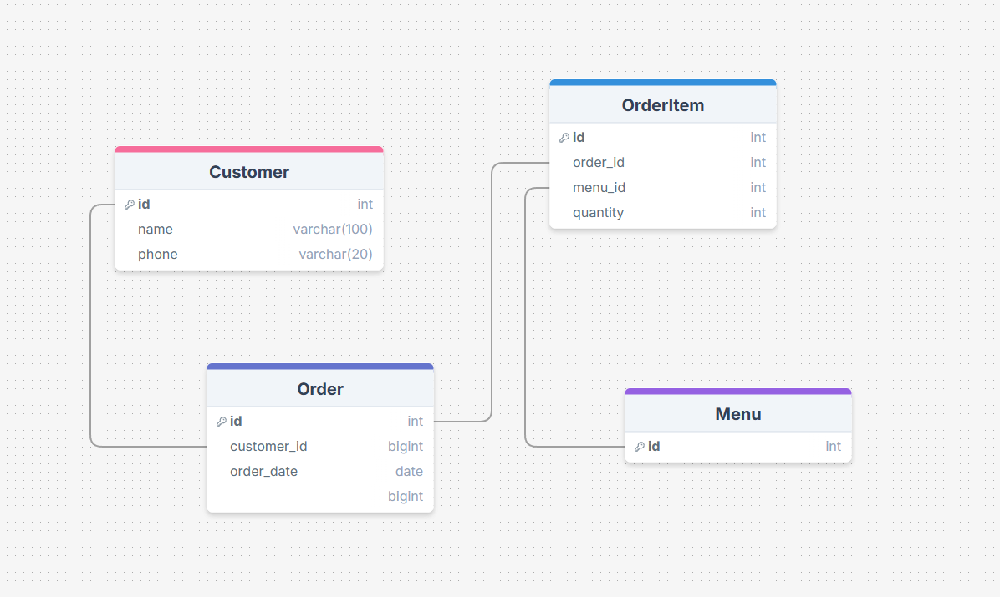

# Restaurant

This project models data relevant to the operation of a restaurant, including customer information, menu items, orders, and order items.





## Query I thought it did well on

**Question**: Which menu items are the most ordered?

**GPT SQL Response**:
```sql
SELECT m.name, SUM(oi.quantity) AS total_ordered
FROM Menu m
JOIN OrderItem oi ON m.id = oi.menu_id
GROUP BY m.id
ORDER BY total_ordered DESC;
```

**Friendly Response**: The most ordered menu items are Pork Belly (5 orders), Kimchi Stew (3 orders), and Bibimbap (2 orders).


## Question that it tripped up on


Question: Who are the top 3 customers based on the number of orders?

**GPT SQL Response**:
```sql
SELECT c.id, c.name, COUNT(o.id) AS total_orders
FROM Customer c
JOIN Order o ON c.id = o.customer_id
GROUP BY c.id
ORDER BY total_orders DESC
LIMIT 3;
```

SQL Result is just "IDs": [(1, 'Kim Chulsoo', 3), (3, 'Park Minsu', 2), (2, 'Lee Younghee', 1)]

**Friendly response**: The top 3 customers based on the number of orders are Kim Chulsoo (3 orders), Park Minsu (2 orders), and Lee Younghee (1 order).


## Conclusion
For straightforward join queries, GPT performs quite well at generating SQL queries, but the interpretation of results can sometimes be a bit off when more complex or conditional insights are needed. More careful prompting strategies or model training might be required for more advanced query interpretation, especially in terms of translating raw data into user-friendly context. This could be useful for non-technical users but may require some tuning.


